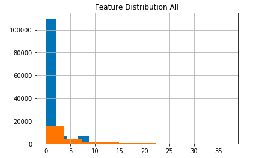
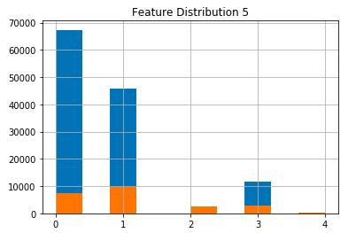

## Problem Background:
* Machine learning techniques are a primary tool for analyzing network traffic and detecting cybersecurity attacks.
* The National Institute of Standards in Technology reported that in 2017, American companies lost 65.6 billion dollars from IT attacks [1].
* Security industry is dependent on costly handling of enormous datasets that is done by hand.
    * Most of today’s machine-learning approaches rely on “anomaly detection,” which tends to trigger false positives
* Therefore, a solution for identifying malicious attacks through a more efficient, effective and lower cost method is greatly needed.

## NSL-KDD Dataset:
* Improved version of the KDD Cup 1999 Dataset
* Does not include the redundant records in the KDD'99 train set
* The classifiers will not be biased towards more frequent records
* The number of records in the train and test sets are reasonable
* No need to randomly select a small portion
* Consists of 1,074,992 distinct records, each of which contains 41 features and is labeled as either normal or as one of four attack types:
    * **Denial of Service Attack (DoS):** denies legitimate users or requests for a machine
    * **User to Root Attack (U2R):** exploits some vulnerability to gain root access to the system
    * **Remote to Local Attack (R2L):** the attacker has the ability to send packets to a machine over a network but does not have an account on that machine and exploits some vulnerability to gain local access as a user of that machine
    * **Probing Attack:** gathers information about a network of computers for the purpose of circumventing security controls

 
* The KDD dataset has three types of features:
	* **Basic Features:** all the attributes that can be extracted from a TCP/IP connection, most of which lead to an implicit delay in detection
	* **Traffic Features:** features that are computed with respect to a window interval, divided into two groups:
  		* "Same Host” features: examine only the connections in the past 2 seconds that have the same destination host as the current connection, also calculate statistics related to protocol behavior, service, etc.
  		* "Same Service” features: examine only the connections in the past 2 seconds that have the same service as the current connection
	* **Content Features:** features to be able to look for suspicious behavior in the data portion of the packets (R2L and U2R), e.g., number of failed login attempts

## Approach
* What have people already done?
    * AI², which incorporates expert input in a system that combines supervised and unsupervised learning to detect 85% of attacks [2].
    * Chowdhury, et al. displays network information as a graph and automatically identify botnet attack by using clustering algorithms.

* What is new in your approach?
    * We will develop our project while holding an unbiased and purely educational perspective. We are not a company with any stake and we are not competing in the competition, so we aren't trying to solve the problem.

* Why do you think you approach can effectively solve the problem?
    * Our goal is purely specific to this data set, so we can take shortcuts and make assumptions

## Part 1: General
Our goals for this section were to:
1. Explore the dataset
2. Establish a baseline for how well we can classify with minimal modifications
 
** Understanding Feature Distributions **

 

### References
1. A Review on Cyber Security Datasets for Machine Learning Algorithms
Yavanoglu, Ozlem, and Murat Aydos. “A Review on Cyber Security Datasets for Machine Learning Algorithms.” 2017 IEEE International Conference on Big Data (Big Data), 2017, doi:10.1109/bigdata.2017.8258167.
2. http://news.mit.edu/2016/ai-system-predicts-85-percent-cyber-attacks-using-input-human-experts-0418
3. https://link.springer.com/article/10.1186/s40537-017-0074-7
4. Dataset: http://kdd.ics.uci.edu/databases/kddcup99/kddcup99.html
5. https://www.ee.ryerson.ca/~bagheri/papers/cisda.pdf
6. https://github.com/vinayakumarr/Network-Intrusion-Detection/blob/master/NSL-KDD/classical/binary/all.py
